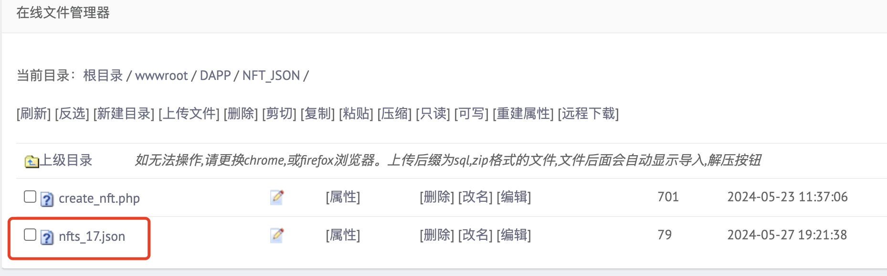

# 目前需要的新功能： JSON 数据编辑与上传  
**背景**： NFT再被创建的过程中，需要输入的其中一个参数是：URI，本质上很像URL链接。指向的是一个json数据链接。  
**你的任务**是：创建一个内部界面，不需要在 APP 里显示 但是是我们内部查看、修改、上传JSON 数据的界面，相当于后台。  
我在这里放出例子：  
向链接`http://xianxiangchain.xyz/DAPP/NFT_JSON/create_nft.php`发送 post请求，内容是json数据。  
注意发送的数据中必须有“TokenID：XX” 这个键值对，因为脚本会提取 tokenID 的具体值来创建json文件。  

发送前服务器目录下只有一个脚本。
  
post 发送json数据，然后服务器目录下会新产生 nfts_17.json 这个文件：
  
我们可以直接在浏览器里输`http://xianxiangchain.xyz/DAPP/NFT_JSON/nfts_17.json`  
  

由此全流程结束，请你设计一个前端界面，能够帮我们查看、修改、重新上传NFT的json数据